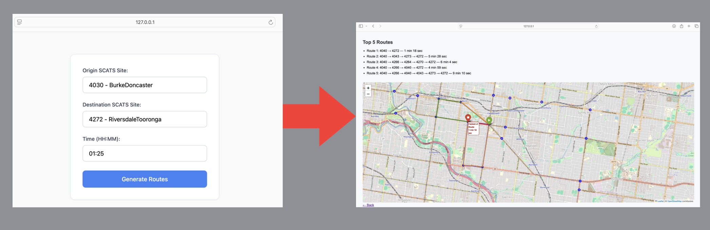

# Traffic-Based Route Guidance System (TBRGS)

## Project Overview
The Traffic-Based Route Guidance System (TBRGS) is an intelligent traffic prediction and visualization application. It leverages machine learning models (RNN, LSTM, GRU) trained on historical SCATS traffic data to predict vehicle volumes and estimate travel times across Melbourne. Users can input an origin SCATS site, destination SCATS site, and a specific time of day to generate:

- Top 5 shortest travel-time routes based on live traffic conditions.
- An interactive map showing all predicted routes, SCATS nodes, and estimated durations.

The system is powered by Flask, TensorFlow, and Folium, and includes a user-friendly web interface with dropdown selection and visual feedback.

---

## Visualization with Interactive Map

The system provides a comprehensive interactive map visualization that displays:

- **Route Visualization**: Top 5 predicted fastest routes color-coded by travel time
- **SCATS Network**: All traffic monitoring sites across Boorondora
- **Real-time Predictions**: ML-powered traffic volume forecasts for each route segment
- **Interactive Elements**: Clickable markers and route lines with detailed information
- **Travel Time Estimates**: Dynamic calculations based on current traffic predictions



The interactive map is generated using Folium and provides users with an intuitive visual representation of their route options, making it easy to compare different paths and make informed travel decisions.

---

## Team Members
| Student Name                | Student ID   |
|-----------------------------|--------------|
| Ananda Pathiranage Ruveen Thathsilu Jayasinghe  | 104317649    |
| Denver J Cope               | 104738758    |
| Faxiz Kallupalathingal      | 104658733    |
| Rahat Alam                  | 103810105    |

---

## How to Run the Project

### 1. Clone the Repository
```bash
git clone https://github.com/ruvxn/Traffic-Guidance-System.git
cd Traffic-Guidance-System
```

### 2. Create a Virtual Environment
```bash
python3 -m venv TBRGSvenv
source TBRGSvenv/bin/activate  # On Windows: TBRGSvenv\Scripts\activate
```

### 3. Install Required Packages
```bash
pip install -r requirements.txt
```

### 4. Run the Web Application
```bash
python app.py
```

Then open your browser and go to:  
[http://127.0.0.1:5000/](http://127.0.0.1:5000/)

---

## Features
- SCATS input dropdown with nicknames for easy selection
- ML-powered traffic volume predictions (LSTM, RNN, GRU, TCN)
- A* and Yen's algorithm integration
- Interactive map via Folium
- Top 5 predicted fastest paths shown with color-coded lines and travel time

---

## File Structure
```
├── app.py                 # Flask backend
├── main.py                # Core route & map logic
├── templates/
│   ├── index.html         # User input form
│   ├── result.html        # Routes + embedded map
├── static/
│   └── map_with_routes.html
├── datasets/processed/    # Cleaned SCATS & edge data
├── models/                # Trained ML models
├── src/                   # A* search and other helpers
├── requirements.txt
├── visualisation.png      
└── README.md
```

---

## Notes
- The dataset and ML models must be preloaded before first run.
- System uses historical data from 2006 for predictions.
- Map and routes are dynamically generated per user request.

---

